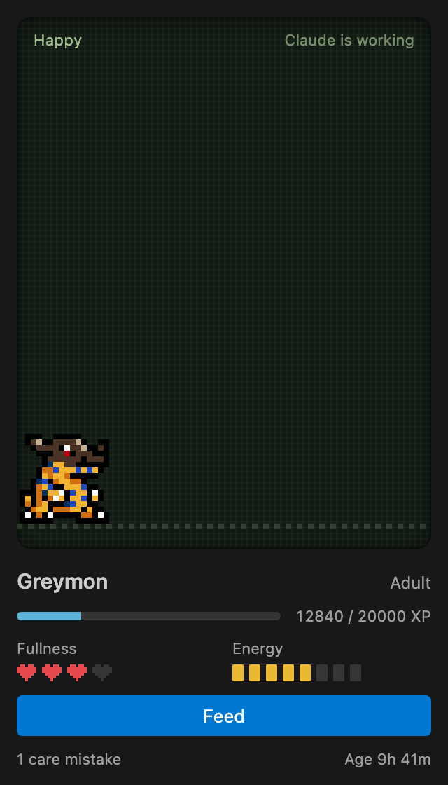

# Digimon Buddy

A V-Pet Digimon for VS Code's secondary side bar. It grows while you code, and while Claude Code codes in your workspace.

The extension lives in [`digimon-vscode/`](digimon-vscode): see its [README](digimon-vscode/README.md) for how it works, and [evolution lines](digimon-vscode/docs/evolution-lines.md) for every Digimon you can raise.

The source code is MIT licensed. The sprites are not: this is an unofficial fan project, not affiliated with Bandai or Toei Animation. See [credits and disclaimer](digimon-vscode/README.md#credits-and-disclaimer).
