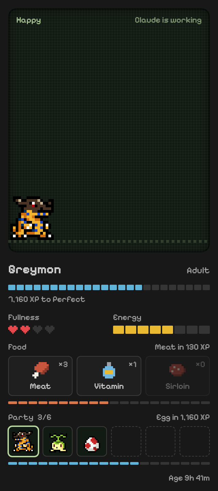
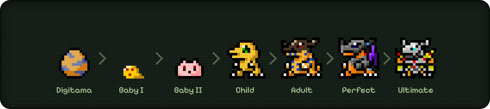

# Digimon Buddy

A V-Pet style Digimon that lives in VS Code's secondary side bar (the right side, next to Chat) and grows while you code. Connect Claude Code and it grows while Claude codes too.

<p align="center">

</p>

## How it works

You start with a random Digitama. Coding earns XP, and XP drives evolution through seven stages:
Digitama → Baby I → Baby II → Child → Adult → Perfect → Ultimate.

<p align="center">

</p>

| Activity | XP |
| --- | --- |
| Editing (at most once per second) | 1 |
| Saving a file | 5 |
| Making a git commit | 25 |

Your Digimon needs care:

- **Fullness** drops over time. Feed it from the food tray under its screen. At zero it starves: it earns no XP and cannot evolve until fed.
- **Energy** drains as it earns XP. At zero it is exhausted and earns half XP.
- **Sleep** happens after 5 minutes without activity. Energy recovers while it sleeps.

Up to Child, evolution is automatic. When a Child has enough XP, it waits for you to choose one of two paths (for Agumon: Greymon → MetalGreymon → WarGreymon, or Tyrannomon → SkullGreymon → BlackWarGreymon). The choice fixes its Adult, Perfect, and Ultimate forms.

Time only passes while VS Code is open, so a weekend away will not starve it.

## Food

All food is earned. Every coding action adds to a lifetime effort counter, and milestones on it repeat forever:

| Food | Earned every | Effect |
| --- | --- | --- |
| Meat | 250 XP | +25 fullness |
| Vitamin | 1,000 XP | +40 energy |
| Sirloin | 2,500 XP | Refills fullness and energy |

You start with 3 meat. Effort counts even while your Digimon is starving and earning no XP itself, so you can always code your way back to food. Food it would not benefit from (meat when full, anything for an egg) is refused and not used up.

## Buddies

Every 3,000 XP of effort earns a new egg, preferring lines you do not have yet. Up to 6 buddies fit in your roster; click one to make it active. Only the active buddy gets hungry, sleeps, and earns XP; the others stay frozen exactly as you left them. When the roster is full, new eggs wait until you release a buddy (**Digimon: Release Buddy**, which asks first).

## Screen background

Run **Digimon: Change Screen Background** (the paint can in the view's title bar) to pick what your Digimon stands on: Dark LCD, Classic LCD, Night sky, Day sky, Sunset, or Meadow. Each option previews live as you move through the list. The choice is the `digimon.appearance.screen` setting, so it syncs with the rest of your VS Code settings.

## Your save

Your buddies, food, and milestones are saved in one file, `game.json`, in VS Code's global storage for this extension (**Digimon: Open Save Folder** shows it). Every VS Code window reads and writes that same file, so progress made in one window is never overwritten by another.

There are 13 evolution lines, listed in [docs/evolution-lines.md](docs/evolution-lines.md) and defined in `src/model/species.ts`. Adding one is a data change; `npm run test:unit` checks that every sprite it references exists.

## Claude Code

Run **Digimon: Connect Claude Code** (or accept the prompt on first start) to let Claude Code sessions feed your Digimon. It adds nine hooks to `~/.claude/settings.json`, after asking, with a backup at `settings.json.digimon-backup`. **Digimon: Disconnect Claude Code** removes them. Requires `python3`.

Sessions whose working directory is inside this window's workspace count as activity:

| Claude event | Effect |
| --- | --- |
| You send a prompt | 3 XP |
| Each minute a session is working | 2 XP per session |
| Claude finishes its turn | The pet cheers |
| A tool call fails | The pet refuses |
| An API error ends the turn | The pet looks sad |

While a session runs, the screen shows "Claude is working", or a blinking "Claude needs you" when Claude waits on a permission prompt or your input. Click it (or run **Digimon: Show Waiting Claude Session**) to jump to the terminal that session runs in; if it runs elsewhere, such as the Claude panel, you get the folder name instead.

**It does not slow Claude down.** The hooks are `async`, which Claude Code runs in the background without waiting and whose output it ignores. Each one is a ~40 ms stdlib-only Python script that appends one short line to a file and always exits 0.

**What it records:** event kind, tool name, session id, working directory, and time, in an owner-only file at `~/.claude/digimon/events.jsonl` that rotates at 256 KiB. No prompts, code, tool inputs, or tool output. See [docs/claude-events.md](docs/claude-events.md).

## Commands

- `Digimon: Feed`, `Digimon: Choose Evolution`, `Digimon: Switch Buddy`, `Digimon: Release Buddy`
- `Digimon: Open Save Folder`
- `Digimon: Start Over` (asks before discarding everything)
- `Digimon: Connect Claude Code` / `Digimon: Disconnect Claude Code`

## Settings

- `digimon.appearance.screen`: the screen background behind your Digimon.
- `digimon.notifications`: show notifications for evolution, starvation, and exhaustion. Default `true`.
- `digimon.claude.enabled`: react to Claude Code sessions in this workspace. Default `true`.
- `digimon.claude.eventsPath`: event log written by the digimon-claude hooks. Default `~/.claude/digimon/events.jsonl`.

## Development

```sh
npm install
npm run compile      # typecheck, lint, bundle
npm run test:unit    # model tests, plain mocha, no VS Code needed
npm test             # full suite inside a downloaded VS Code
npm run docs:evolutions  # regenerate docs/evolution-lines.md after editing species.ts
cd claude-hook && uv run pytest  # hook script tests
```

Press `F5` in VS Code to launch an Extension Development Host.

Game rules live in `src/model/pet.ts` (`RULES`) as pure functions with no `vscode` dependency. The webview in `media/` only animates the state the extension sends it.

## Credits and disclaimer

This is an unofficial fan project. It is not affiliated with, endorsed by, or sponsored by Bandai or Toei Animation. Digimon and all related names are trademarks of Bandai.

The view uses the [Pixelify Sans](https://github.com/eifetx/Pixelify-Sans) pixel font, under the SIL Open Font License (`media/fonts/OFL.txt`). Sprites come from Tortoiseshel's Digimon sprite collection and remain the property of their respective owners; they are not covered by this project's MIT license, which applies to the source code only. Rights holders who want anything removed can [open an issue](https://github.com/Austin-Senna/digimon-vscode/issues) and it will be taken down.
